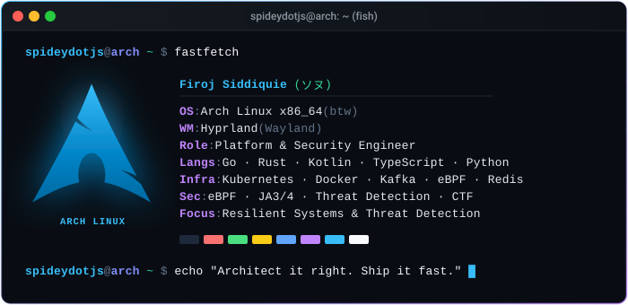

# Firoj Siddiquie · ソヌ

**Platform & Security Engineer**

*Architect it right. Ship it fast. Keep it minimal.*

 

  

---

### 🛠️ Tech Stack & Weapons of Choice

| Domain | Technologies |
| :--- | :--- |
| **Languages** | `Go` · `Rust` · `Kotlin` · `TypeScript` · `Python` · `Java` |
| **Infra & Cloud** | `Kubernetes` · `Docker` · `Kafka` · `gRPC` · `eBPF` · `Redis` · `PostgreSQL` |
| **Security & Systems** | `eBPF Tracing` · `JA3/JA4 Fingerprinting` · `Ed25519 Cryptography` · `CTF` |
| **Client & Mobile** | `React` · `Next.js` · `Tailwind CSS` · `Jetpack Compose` · `Flutter` |

---

### 🚀 Featured Projects

| Project | Description | Stack |
| :--- | :--- | :--- |
| **[ollama-android](https://github.com/spideydotjs/ollama-android)** ⭐ 26 | Native, full-featured Ollama client for running and chatting with local LLMs on Android. | `Kotlin` `Jetpack Compose` `AI` |
| **[kube-deploy](https://github.com/spideydotjs/kube-deploy)** ⭐ 6 | Zero-downtime deployment pipeline for Kubernetes clusters with automated rollbacks and health monitoring. | `Go` `Kubernetes` `gRPC` |
| **[woodpecker-rs](https://github.com/spideydotjs/woodpecker-rs)** | High-performance, RFC-compliant SMTP mail server built from scratch in Rust. | `Rust` `SMTP` `Networking` |
| **[legit](https://github.com/spideydotjs/legit)** | Privacy-preserving KYC & document verification protocol utilizing Ed25519 cryptography. | `Kotlin` `Ed25519` `Zero-Knowledge` |
| **[vectopus](https://github.com/spideydotjs/vectopus)** | Browser-based PNG-to-SVG vectorization studio with real-time canvas preprocessing & tracing. | `TypeScript` `React` `SVG` |
| **[baklava-arch](https://github.com/spideydotjs/baklava-arch)** | Custom Arch-based Linux distribution pre-baked with modern Hyprland dotfiles. | `Arch Linux` `Hyprland` `Shell` |

<b>📂 More Repositories &amp; Experiments (Click to expand)</b>

 

| Project | Description | Stack |
| :--- | :--- | :--- |
| **[certify-sol](https://github.com/spideydotjs/certify-sol)** | Blockchain-based certificate issuance and verification protocol built on Solana. | `Solana` `Rust` `TypeScript` |
| **[Soundcore](https://github.com/spideydotjs/Soundcore)** | Expressive Material 3 music player supporting local media files and YouTube Music integration. | `Kotlin` `Jetpack Compose` `Android` |
| **[Sekura](https://github.com/spideydotjs/Sekura)** | Material 3 based, open-source 2FA (Two-Factor Authentication) security application. | `Kotlin` `Security` `Android` |
| **[sherlock](https://github.com/spideydotjs/sherlock)** ⭐ 1 | OSINT tool to search for target usernames across social networks. | `JavaScript` `CLI` `OSINT` |
| **[hyprdroid](https://github.com/spideydotjs/hyprdroid)** ⭐ 3 | Android-themed Hyprland configuration dotfiles and Quickshell scripts. | `QML` `Hyprland` `Wayland` |
| **[pawrcel](https://github.com/spideydotjs/pawrcel)** | Cross-platform file transfer agent designed to transfer files over long distances using P2P handshakes. | `Kotlin` `P2P` `Networking` |
| **[kCoin](https://github.com/spideydotjs/kCoin)** | A basic blockchain implementation to demonstrate decentralized ledger architectures and hashing. | `Kotlin` `Cryptography` |

---

 

*“commits aren't contributions. working code is.”*

